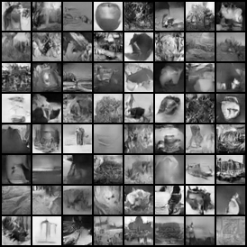
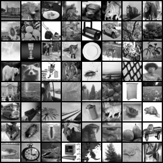

**Pre-trained GAN for CIFAR100**

### cifar100

The cifar100 gan here generates 32x32x1 images for generating grayscale images. Trained for 200 epochs. Weights [here](https://github.com/csinva/pytorch_gan_pretrained/tree/master/cifar100_dcgan_grayscale/weights). There are also weights/code for generating images which are 34x45x1.

| generated samples                                            | data samples                                           |
| ------------------------------------------------------------ | ------------------------------------------------------ |
|  |  |

### reference

- This code is copied from this  

- feel free to use/share this code openly

- here's a citation if you want to reference it: [](https://doi.org/10.5281/zenodo.2778737)

```
@misc{singh2019gan,
  author       = {Chandan Singh},
  title        = {Pretrained GANs in pytorch for MNIST/CIFAR.},
  month        = {May},
  year         = {2019},
  doi          = {10.5281/zenodo.2778737},
  version      = {1.0.0},
  publisher    = {Zenodo},
  url          = {https://doi.org/10.5281/zenodo.2778737}
}
```

- for similar projects, see some other repos: (e.g. [acd](https://github.com/csinva/acd)) or website ([csinva.github.io](https://csinva.github.io/))
